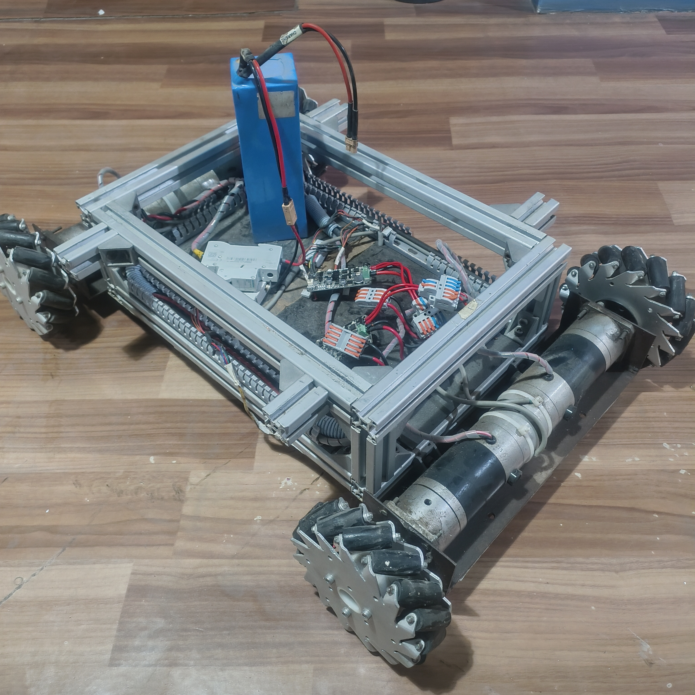

# Monocular-Visual-SLAM-ROS2-RPi5

<p align="center">
  
</p>

## Overview

Monocular Visual SLAM rover platform built using ROS 2 and Raspberry Pi 5 featuring AI-based depth estimation, pseudo 3D mapping, computer vision, and autonomous robotic perception using a single USB camera.

This project focuses on developing a low-cost intelligent robotic rover capable of:

- Monocular visual SLAM
- AI-based depth estimation
- Pseudo 3D terrain mapping
- Camera-based environmental perception
- Embedded computer vision processing
- Autonomous robotic navigation
- Real-time obstacle understanding

---

# Features

- ROS2-based robotic architecture
- Raspberry Pi 5 embedded integration
- Monocular visual SLAM pipeline
- AI-powered depth estimation
- Real-time monocular depth sensing
- Pseudo 3D contour mapping
- Pseudo 3D point cloud visualization
- OpenCV computer vision framework
- PWM motor control system
- Autonomous exploration framework

---

# Hardware Used

- Raspberry Pi 5
- USB Monocular Camera
- Motor Driver Module
- DC Geared Motors
- Rover Chassis Platform
- Power Supply Module

---

# Software Stack

- ROS 2
- Python
- OpenCV
- NumPy
- Monocular Depth Estimation
- Computer Vision Algorithms

---

# Rover Platform

<p align="center">
  
</p>

Custom-built autonomous rover chassis integrated with Raspberry Pi 5 and monocular vision system for embedded SLAM and robotic navigation experiments.

---

# Monocular Depth Estimation Result

<p align="center">
  
</p>

The monocular depth estimation module predicts relative scene depth from a single RGB camera frame using lightweight AI-based depth inference techniques optimized for Raspberry Pi.

The generated depth map enables environmental understanding, obstacle awareness, and foundational perception for autonomous robotic navigation without requiring dedicated depth sensors.

---

# Pseudo 3D Contour Mapping Result

<p align="center">
  
</p>

The pseudo 3D contour mapping system converts monocular depth information into contour-based terrain visualization for simplified spatial analysis and environment representation.

This provides a lightweight alternative to traditional 3D mapping approaches while maintaining real-time performance on embedded hardware.

---

# Pseudo 3D Point Cloud Visualization

<p align="center">
  
</p>

A pseudo 3D point cloud was generated using a single USB webcam and AI-based monocular depth estimation on Raspberry Pi.

The system captures an image, predicts relative depth using a lightweight monocular depth estimation model, and converts image pixels into 3D coordinates to visualize a point cloud representation of the environment.

The generated visualization represents walls, floor surfaces, and surrounding objects without using LiDAR or dedicated depth sensors, demonstrating low-cost embedded 3D perception using monocular computer vision techniques.

---

# Project Structure

```bash
motor_test.py                  # PWM motor control testing
visionbaseddepthsence.py       # Monocular depth estimation pipeline
psudo3dmappingmonovision.py    # Pseudo 3D contour mapping
README.md
